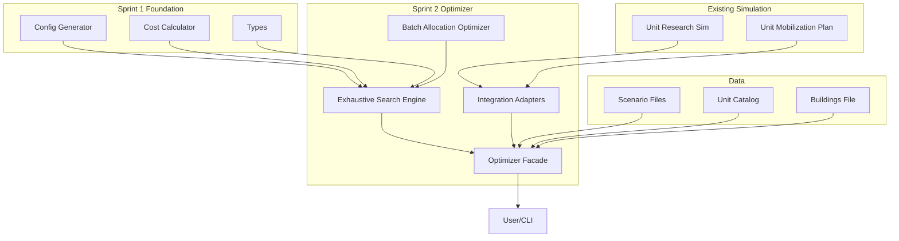

# Sprint 2: Force Projection Optimizer (REVISED)

## Overview

Build an **exhaustive search optimizer** with smart filtering that uses the Sprint 1 foundation modules to find optimal force projection strategies. This approach is simpler, faster, and guaranteed optimal compared to beam search.

**Key Insight:** The configuration space is small enough (~500 configs) that we can evaluate ALL feasible configurations and return the provably optimal solution.

---

## Why Not Beam Search?

After analyzing the problem:
- Configuration space: ~500 total configs, ~100-200 after filtering
- Evaluation time: ~1ms per config
- **Total optimization time: ~150ms** (fast enough!)
- Beam search would be **slower and more complex** with no benefit

See [`optimization-algorithm-analysis.md`](optimization-algorithm-analysis.md) for detailed analysis.

---

## Architecture



---

## Sprint 2 Deliverables

### 1. **Batch Allocation Optimizer** 🆕 ⭐ (CRITICAL)
**File:** `src/engine/optimization/batch-allocation-optimizer.ts`

**Purpose:** Given a city configuration, find the optimal distribution of units across levels L1-L5.

This is the **real optimization challenge** - not the configuration search!

**Key Functions:**
```typescript
export type BatchOptimizationResult = {
  allocation: BatchAllocation;
  cost: CostBreakdown;
  completionHour: number;
  feasible: boolean;
};

// Find optimal L1-L5 distribution for a given config
export function optimizeBatchAllocation(
  unitId: string,
  totalUnits: number,
  config: MobilizationConfig,
  researchSchedule: ResearchSchedule,
  deadlineHour: number,
  unitCatalog: UnitCatalog,
  buildings: BuildingsFile,
  moralePct?: number
): BatchOptimizationResult;

// Greedy heuristic for quick estimates
export function greedyBatchAllocation(
  totalUnits: number,
  maxLevel: number
): BatchAllocation;

// Dynamic programming approach for optimal allocation
export function dpBatchAllocation(
  unitId: string,
  totalUnits: number,
  config: MobilizationConfig,
  researchSchedule: ResearchSchedule,
  deadlineHour: number,
  unitCatalog: UnitCatalog,
  buildings: BuildingsFile
): BatchAllocation;
```

**Algorithm Options:**

1. **Greedy (Fast):** Maximize highest level units within deadline
2. **Dynamic Programming (Optimal):** Find true optimal distribution
3. **Heuristic Search:** Balance cost vs. capability

---

### 2. **Exhaustive Search Engine** 🆕
**File:** `src/engine/optimization/exhaustive-optimizer.ts`

**Purpose:** Evaluate all feasible configurations and return the optimal solution.

**Key Functions:**
```typescript
export type OptimizationObjective = 
  | "minimize_cost"           // Minimize total cost
  | "minimize_time"           // Minimize completion time
  | "maximize_efficiency"     // Best cost/time ratio
  | "pareto_frontier";        // Return all non-dominated solutions

export type OptimizationConstraints = {
  maxCities: number;
  maxROLevel: number;
  deadlineHour: number;
  availableCities: string[];
  moralePct?: number;
  minROLevel?: number;        // Don't consider RO levels below this
};

export type OptimizationResult = {
  bestConfig: MobilizationConfig;
  batchAllocation: BatchAllocation;
  costBreakdown: CostBreakdown;
  completionHour: number;
  researchSchedule: ResearchSchedule;
  
  // Statistics
  stats: {
    totalConfigs: number;
    feasibleConfigs: number;
    evaluatedConfigs: number;
    prunedConfigs: number;
    optimizationTimeMs: number;
  };
};

export type ParetoSolution = OptimizationResult & {
  objectives: {
    cost: number;
    time: number;
    efficiency: number;
  };
};

// Main optimization function
export function optimizeForceProjection(
  unitId: string,
  totalUnits: number,
  constraints: OptimizationConstraints,
  objective: OptimizationObjective,
  unitCatalog: UnitCatalog,
  buildings: BuildingsFile,
  scenario: ScenarioFile
): OptimizationResult;

// Multi-objective optimization
export function findParetoFrontier(
  unitId: string,
  totalUnits: number,
  constraints: OptimizationConstraints,
  unitCatalog: UnitCatalog,
  buildings: BuildingsFile,
  scenario: ScenarioFile
): ParetoSolution[];

// Helper: Score configuration by objective
function scoreByObjective(
  cost: CostBreakdown,
  completionHour: number,
  objective: OptimizationObjective
): number;

// Helper: Check if solution A dominates solution B
function dominates(a: ParetoSolution, b: ParetoSolution): boolean;
```

**Algorithm:**
```typescript
function optimizeForceProjection(...) {
  const startTime = performance.now();
  
  // Step 1: Generate ALL configurations
  const allConfigs = generateMobilizationConfigs(
    constraints.availableCities,
    constraints.maxCities,
    constraints.maxROLevel,
    totalUnits,
    { buildings, buildingId: "recruiting_office", startingBuildingLevel: 0 }
  );
  
  // Step 2: Early pruning (cost-based)
  const viableConfigs = allConfigs.filter(config => 
    config.buildingCost <= estimateMaxAffordableCost(...)
  );
  
  // Step 3: Optimize research schedule (once, shared by all configs)
  const researchSchedule = optimizeResearchSchedule(
    unitId, 5, scenario, unitCatalog
  );
  
  // Step 4: Filter feasible configs (deadline check with greedy batch)
  const feasibleConfigs = filterFeasibleConfigs(viableConfigs, {
    unitId,
    batchAllocation: greedyBatchAllocation(totalUnits, 5),
    researchSchedule,
    deadlineHour: constraints.deadlineHour,
    unitCatalog,
    buildings,
    moralePct: constraints.moralePct
  });
  
  // Step 5: Optimize batch allocation for each feasible config
  const evaluatedConfigs = feasibleConfigs.map(config => {
    const batchResult = optimizeBatchAllocation(
      unitId, totalUnits, config, researchSchedule,
      constraints.deadlineHour, unitCatalog, buildings
    );
    
    return {
      config,
      batchAllocation: batchResult.allocation,
      costBreakdown: batchResult.cost,
      completionHour: batchResult.completionHour,
      score: scoreByObjective(batchResult.cost, batchResult.completionHour, objective)
    };
  });
  
  // Step 6: Return best
  const best = evaluatedConfigs.sort((a, b) => a.score - b.score)[0];
  
  return {
    ...best,
    researchSchedule,
    stats: {
      totalConfigs: allConfigs.length,
      feasibleConfigs: feasibleConfigs.length,
      evaluatedConfigs: evaluatedConfigs.length,
      prunedConfigs: allConfigs.length - feasibleConfigs.length,
      optimizationTimeMs: performance.now() - startTime
    }
  };
}
```

---

### 3. **Research Schedule Optimizer** 🆕
**File:** `src/engine/optimization/research-schedule-optimizer.ts`

**Purpose:** Determine optimal research timing given scenario constraints.

**Key Functions:**
```typescript
export function optimizeResearchSchedule(
  unitId: string,
  maxLevel: number,
  scenario: ScenarioFile,
  unitCatalog: UnitCatalog
): ResearchSchedule;

// Greedy: Research as soon as unlocked
export function greedyResearchSchedule(
  unitId: string,
  maxLevel: number,
  scenario: ScenarioFile,
  unitCatalog: UnitCatalog
): ResearchSchedule;

// Delayed: Research just-in-time for mobilization
export function delayedResearchSchedule(
  unitId: string,
  maxLevel: number,
  mobilizationStartHour: number,
  scenario: ScenarioFile,
  unitCatalog: UnitCatalog
): ResearchSchedule;
```

---

### 4. **Integration Adapters** 🆕
**File:** `src/engine/optimization/integration-adapters.ts`

**Purpose:** Bridge between optimizer types and existing simulation types.

**Key Functions:**
```typescript
// Convert optimizer types to simulation types
export function toMobilizationDemand(
  config: MobilizationConfig,
  batchAllocation: BatchAllocation,
  unitId: string
): MobilizationDemand;

export function toResearchTargets(
  researchSchedule: ResearchSchedule,
  unitId: string
): UnitResearchTargets;

// Convert simulation results to optimizer types
export function fromResearchSimulation(
  result: UnitResearchSimulationResult
): ResearchSchedule;

// Validation helpers
export function validateOptimizationInputs(
  unitId: string,
  totalUnits: number,
  constraints: OptimizationConstraints,
  unitCatalog: UnitCatalog,
  buildings: BuildingsFile
): void;

// Estimation helpers
export function estimateMaxAffordableCost(
  scenario: ScenarioFile,
  country: CountryFile
): number;
```

---

### 5. **Optimizer Facade** 🆕
**File:** `src/engine/optimization/force-projection-optimizer.ts`

**Purpose:** High-level API that orchestrates the entire optimization workflow.

**Key Functions:**
```typescript
export type ForceProjectionPlan = {
  unitId: string;
  totalUnits: number;
  objective: OptimizationObjective;
  result: OptimizationResult;
  timeline: {
    researchPhase: ResearchSchedule;
    mobilizationPhase: MobilizationConfig;
    completionHour: number;
  };
  costs: {
    building: number;
    mobilization: number;
    upkeep: number;
    total: number;
  };
  recommendations: string[];
};

// End-to-end optimization
export function planForceProjection(
  unitId: string,
  totalUnits: number,
  scenario: ScenarioFile,
  country: CountryFile,
  unitCatalog: UnitCatalog,
  buildings: BuildingsFile,
  options?: {
    objective?: OptimizationObjective;
    maxCities?: number;
    maxROLevel?: number;
    deadlineHour?: number;
  }
): ForceProjectionPlan;

// Compare multiple strategies
export function compareStrategies(
  unitId: string,
  totalUnits: number,
  scenario: ScenarioFile,
  country: CountryFile,
  unitCatalog: UnitCatalog,
  buildings: BuildingsFile,
  strategies: Array<{
    name: string;
    objective: OptimizationObjective;
    constraints?: Partial<OptimizationConstraints>;
  }>
): Array<ForceProjectionPlan & { strategyName: string }>;

// What-if analysis
export function analyzeDeadlineSensitivity(
  unitId: string,
  totalUnits: number,
  scenario: ScenarioFile,
  country: CountryFile,
  unitCatalog: UnitCatalog,
  buildings: BuildingsFile,
  deadlineRange: { min: number; max: number; step: number }
): Array<{ deadline: number; result: OptimizationResult }>;
```

---

### 6. **Test Suite** 🆕

**Files:**
- `src/engine/optimization/batch-allocation-optimizer.test.ts`
- `src/engine/optimization/exhaustive-optimizer.test.ts`
- `src/engine/optimization/research-schedule-optimizer.test.ts`
- `src/engine/optimization/integration-adapters.test.ts`
- `src/engine/optimization/force-projection-optimizer.test.ts`

**Test Coverage:**
- Unit tests for batch allocation algorithms
- Exhaustive search correctness
- Integration tests with real scenario data
- Performance benchmarks
- Edge cases (single city, max cities, tight deadlines)
- Objective function validation
- Pareto frontier correctness

---

### 7. **CLI Tool** 🆕
**File:** `src/cli/optimize-force-projection.ts`

**Purpose:** Command-line interface for running optimizations.

**Usage:**
```bash
# Optimize for minimum cost
npm run optimize -- \
  --scenario elite_ww3_2026 \
  --country indonesia \
  --unit strike_fighter \
  --count 100 \
  --objective minimize_cost

# Find Pareto frontier
npm run optimize -- \
  --scenario elite_ww3_2026 \
  --country indonesia \
  --unit strike_fighter \
  --count 100 \
  --objective pareto_frontier \
  --output tmp/pareto-solutions.json

# Compare strategies
npm run optimize:compare -- \
  --scenario elite_ww3_2026 \
  --country indonesia \
  --unit strike_fighter \
  --count 100

# Deadline sensitivity analysis
npm run optimize:sensitivity -- \
  --scenario elite_ww3_2026 \
  --country indonesia \
  --unit strike_fighter \
  --count 100 \
  --deadline-min 168 \
  --deadline-max 672 \
  --deadline-step 24
```

---

### 8. **Documentation** 📝

**Files:**
- `docs/optimization-engine.md` - Architecture and design
- `docs/optimization-usage.md` - Usage examples and tutorials
- `docs/optimization-api.md` - API reference
- `docs/batch-allocation-algorithms.md` - Batch optimization strategies
- Update `README.md` with optimization section

---

## Implementation Steps

### **Phase 1: Batch Allocation Optimizer (Days 1-2)** ⭐ PRIORITY

1. ✅ Create `batch-allocation-optimizer.ts`
2. ✅ Implement greedy batch allocation (baseline)
3. ✅ Implement dynamic programming batch allocation (optimal)
4. ✅ Add cost/time trade-off analysis
5. ✅ Write comprehensive tests
6. ✅ Performance benchmarks

**Why First?** This is the critical optimization component that everything else depends on.

### **Phase 2: Research Schedule Optimizer (Day 2)**

7. ✅ Create `research-schedule-optimizer.ts`
8. ✅ Implement greedy research schedule
9. ✅ Implement delayed research schedule
10. ✅ Add scenario integration
11. ✅ Write tests

### **Phase 3: Exhaustive Search Engine (Days 2-3)**

12. ✅ Create `exhaustive-optimizer.ts`
13. ✅ Implement `optimizeForceProjection()`
14. ✅ Implement `findParetoFrontier()`
15. ✅ Add smart pruning heuristics
16. ✅ Write tests with real scenario data
17. ✅ Performance benchmarks

### **Phase 4: Integration & Facade (Day 3)**

18. ✅ Create `integration-adapters.ts`
19. ✅ Implement type conversions
20. ✅ Create `force-projection-optimizer.ts`
21. ✅ Implement high-level API
22. ✅ Write integration tests

### **Phase 5: CLI & Documentation (Days 4-5)**

23. ✅ Create CLI tool
24. ✅ Add npm scripts
25. ✅ Write documentation
26. ✅ Create usage examples
27. ✅ Performance analysis
28. ✅ Code review and polish

---

## Success Metrics

### **Functional Requirements:**
- ✅ Finds provably optimal solution for any valid scenario
- ✅ Completes optimization in < 500ms for typical scenarios
- ✅ Supports all optimization objectives
- ✅ Handles edge cases gracefully

### **Performance Requirements:**
- ✅ Evaluates 100+ configs per second
- ✅ Batch allocation optimization < 10ms per config
- ✅ Total optimization time < 500ms
- ✅ Memory usage < 100MB

### **Quality Requirements:**
- ✅ 90%+ test coverage
- ✅ Zero TypeScript errors
- ✅ All tests passing
- ✅ Comprehensive documentation

---

## Key Differences from Original Plan

| Aspect | Original (Beam Search) | Revised (Exhaustive) |
|--------|----------------------|---------------------|
| **Algorithm** | Beam search with pruning | Exhaustive with filtering |
| **Optimality** | Approximate | Guaranteed optimal |
| **Complexity** | Higher (beam width tuning) | Lower (no parameters) |
| **Speed** | ~50,000 operations | ~5,000 operations |
| **Focus** | Configuration search | Batch allocation |
| **Implementation** | More complex | Simpler |

---

## Risk Mitigation

### **Risk: Batch Allocation is Hard**
- **Mitigation:** Start with greedy, then add DP
- **Mitigation:** Extensive testing with real scenarios
- **Mitigation:** Compare against manual strategies

### **Risk: Performance Issues**
- **Mitigation:** Early pruning heuristics
- **Mitigation:** Caching research schedules
- **Mitigation:** Profile and optimize hot paths

### **Risk: Integration Complexity**
- **Mitigation:** Clear adapter layer
- **Mitigation:** Comprehensive integration tests
- **Mitigation:** Incremental integration

---

## Future Enhancements (Post-Sprint 2)

1. **Multi-Unit Optimization** - Optimize multiple unit types together
2. **Resource Constraints** - Consider available resources
3. **Parallel Evaluation** - Use worker threads
4. **Incremental Optimization** - Update plans as scenario evolves
5. **Machine Learning** - Learn from historical optimizations
6. **Interactive UI** - Web-based optimizer
7. **Sensitivity Analysis** - Robustness testing

---

## Estimated Timeline

- **Phase 1 (Batch Allocation):** 2 days ⭐
- **Phase 2 (Research Schedule):** 0.5 days
- **Phase 3 (Exhaustive Search):** 1.5 days
- **Phase 4 (Integration):** 1 day
- **Phase 5 (CLI & Docs):** 1 day

**Total:** 6 days (approximately 1.5 weeks)

---

## Deliverable Checklist

- [ ] `batch-allocation-optimizer.ts` with greedy + DP algorithms ⭐
- [ ] `research-schedule-optimizer.ts` with scheduling strategies
- [ ] `exhaustive-optimizer.ts` with main optimization engine
- [ ] `integration-adapters.ts` with type conversions
- [ ] `force-projection-optimizer.ts` with high-level API
- [ ] Test files with 90%+ coverage
- [ ] CLI tool for optimization
- [ ] Architecture documentation
- [ ] Usage examples and tutorials
- [ ] API reference
- [ ] Updated README
- [ ] Performance benchmarks
- [ ] All tests passing

---

## Summary

**Sprint 2 will deliver a simpler, faster, and provably optimal force projection optimizer** by:

1. **Focusing on batch allocation** - The real optimization challenge
2. **Using exhaustive search** - Simpler and faster than beam search
3. **Guaranteeing optimality** - No approximations or tuning needed
4. **Providing rich analysis** - Pareto frontiers, sensitivity analysis, comparisons

This approach is **better suited to the problem** and will deliver **superior results with less complexity**.