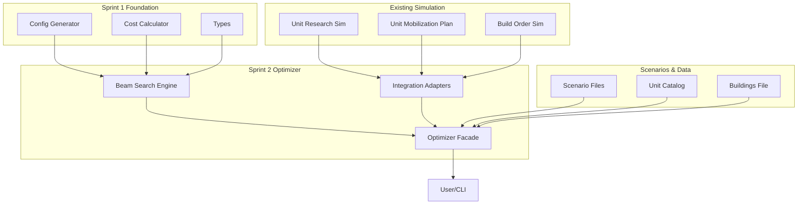

# Sprint 2: Force Projection Beam Search Optimizer

## Overview

Build a beam search optimizer that uses the Sprint 1 foundation modules to find optimal force projection strategies. This sprint integrates the cost calculator and config generator with existing simulation modules to create an end-to-end optimization engine.

---

## Goals

1. **Implement Beam Search Algorithm** - Core optimization engine using Sprint 1 modules
2. **Integration Layer** - Connect optimizer to existing simulation infrastructure
3. **Validation & Testing** - Ensure correctness and performance
4. **Documentation** - Usage examples and architecture documentation

---

## Architecture



---

## Sprint 2 Deliverables

### 1. **Beam Search Engine** 🆕
**File:** `src/engine/optimization/beam-search-optimizer.ts`

**Purpose:** Core optimization algorithm that explores the configuration space using beam search.

**Key Functions:**
```typescript
export type OptimizationObjective = 
  | "minimize_cost"           // Minimize total cost
  | "minimize_time"           // Minimize completion time
  | "maximize_efficiency";    // Best cost/time ratio

export type OptimizationConstraints = {
  maxCities: number;
  maxROLevel: number;
  deadlineHour: number;
  availableCities: string[];
  moralePct?: number;
};

export type OptimizationResult = {
  bestConfig: MobilizationConfig;
  costBreakdown: CostBreakdown;
  completionHour: number;
  batchAllocation: BatchAllocation;
  researchSchedule: ResearchSchedule;
  explored: number;
  pruned: number;
  beamWidth: number;
};

// Main optimization function
export function optimizeForceProjection(
  unitId: string,
  totalUnits: number,
  constraints: OptimizationConstraints,
  objective: OptimizationObjective,
  unitCatalog: UnitCatalog,
  buildings: BuildingsFile,
  beamWidth?: number
): OptimizationResult;

// Batch allocation optimizer
export function optimizeBatchAllocation(
  unitId: string,
  totalUnits: number,
  config: MobilizationConfig,
  researchSchedule: ResearchSchedule,
  deadlineHour: number,
  unitCatalog: UnitCatalog,
  buildings: BuildingsFile
): BatchAllocation;

// Research schedule optimizer
export function optimizeResearchSchedule(
  unitId: string,
  maxLevel: number,
  scenario: ScenarioFile,
  unitCatalog: UnitCatalog
): ResearchSchedule;
```

**Algorithm:**
1. Generate initial configuration space using `generateMobilizationConfigs()`
2. Filter feasible configurations using `filterFeasibleConfigs()`
3. For each configuration in beam:
   - Optimize batch allocation (L1-L5 distribution)
   - Calculate total cost using `calculateTotalCost()`
   - Score based on objective function
4. Prune to beam width, keeping best candidates
5. Return optimal configuration with full breakdown

---

### 2. **Integration Adapters** 🆕
**File:** `src/engine/optimization/integration-adapters.ts`

**Purpose:** Bridge between optimizer types and existing simulation types.

**Key Functions:**
```typescript
// Convert optimizer types to simulation types
export function toMobilizationDemand(
  config: MobilizationConfig,
  batchAllocation: BatchAllocation,
  unitId: string
): MobilizationDemand;

export function toResearchTargets(
  researchSchedule: ResearchSchedule,
  unitId: string
): UnitResearchTargets;

// Convert simulation results to optimizer types
export function fromResearchSimulation(
  result: UnitResearchSimulationResult
): ResearchSchedule;

export function fromMobilizationPlan(
  result: MobilizationPlanResult
): {
  config: MobilizationConfig;
  batchAllocation: BatchAllocation;
};

// Validation helpers
export function validateOptimizationInputs(
  unitId: string,
  totalUnits: number,
  constraints: OptimizationConstraints,
  unitCatalog: UnitCatalog,
  buildings: BuildingsFile
): void;
```

---

### 3. **Optimizer Facade** 🆕
**File:** `src/engine/optimization/force-projection-optimizer.ts`

**Purpose:** High-level API that orchestrates the entire optimization workflow.

**Key Functions:**
```typescript
export type ForceProjectionPlan = {
  unitId: string;
  totalUnits: number;
  objective: OptimizationObjective;
  result: OptimizationResult;
  timeline: {
    researchPhase: ResearchSchedule;
    mobilizationPhase: MobilizationConfig;
    completionHour: number;
  };
  costs: {
    building: number;
    mobilization: number;
    upkeep: number;
    total: number;
  };
  recommendations: string[];
};

// End-to-end optimization
export function planForceProjection(
  unitId: string,
  totalUnits: number,
  scenario: ScenarioFile,
  country: CountryFile,
  unitCatalog: UnitCatalog,
  buildings: BuildingsFile,
  options?: {
    objective?: OptimizationObjective;
    beamWidth?: number;
    maxCities?: number;
    maxROLevel?: number;
    deadlineHour?: number;
  }
): ForceProjectionPlan;

// Compare multiple strategies
export function compareStrategies(
  unitId: string,
  totalUnits: number,
  scenario: ScenarioFile,
  country: CountryFile,
  unitCatalog: UnitCatalog,
  buildings: BuildingsFile,
  strategies: Array<{
    name: string;
    objective: OptimizationObjective;
    constraints?: Partial<OptimizationConstraints>;
  }>
): Array<ForceProjectionPlan & { strategyName: string }>;
```

---

### 4. **Test Suite** 🆕

**Files:**
- `src/engine/optimization/beam-search-optimizer.test.ts`
- `src/engine/optimization/integration-adapters.test.ts`
- `src/engine/optimization/force-projection-optimizer.test.ts`

**Test Coverage:**
- Unit tests for beam search algorithm
- Integration tests with real scenario data
- Performance benchmarks
- Edge cases (single city, max cities, tight deadlines)
- Objective function validation
- Type conversion accuracy

---

### 5. **CLI Tool** 🆕
**File:** `src/cli/optimize-force-projection.ts`

**Purpose:** Command-line interface for running optimizations.

**Usage:**
```bash
# Optimize for minimum cost
npm run optimize -- \
  --scenario elite_ww3_2026 \
  --country indonesia \
  --unit strike_fighter \
  --count 100 \
  --objective minimize_cost \
  --beam-width 50

# Compare strategies
npm run optimize:compare -- \
  --scenario elite_ww3_2026 \
  --country indonesia \
  --unit strike_fighter \
  --count 100 \
  --strategies "minimize_cost,minimize_time,maximize_efficiency"

# Output to file
npm run optimize -- \
  --scenario elite_ww3_2026 \
  --country indonesia \
  --unit strike_fighter \
  --count 100 \
  --output tmp/optimization-result.json
```

---

### 6. **Documentation** 📝

**Files:**
- `docs/optimization-engine.md` - Architecture and design
- `docs/optimization-usage.md` - Usage examples and tutorials
- `docs/optimization-api.md` - API reference
- Update `README.md` with optimization section

**Content:**
- Architecture diagrams
- Usage examples for common scenarios
- Performance tuning guide
- Integration patterns
- Troubleshooting guide

---

## Implementation Steps

### **Phase 1: Core Algorithm (Days 1-2)**

1. ✅ Create `beam-search-optimizer.ts`
2. ✅ Implement `optimizeForceProjection()` function
3. ✅ Implement batch allocation optimizer
4. ✅ Implement research schedule optimizer
5. ✅ Add objective function scoring
6. ✅ Write unit tests for beam search

### **Phase 2: Integration (Days 2-3)**

7. ✅ Create `integration-adapters.ts`
8. ✅ Implement type conversion functions
9. ✅ Add validation helpers
10. ✅ Write integration tests with simulation modules
11. ✅ Test with real scenario data

### **Phase 3: Facade & CLI (Days 3-4)**

12. ✅ Create `force-projection-optimizer.ts`
13. ✅ Implement `planForceProjection()` function
14. ✅ Implement `compareStrategies()` function
15. ✅ Create CLI tool
16. ✅ Add npm scripts for optimization commands
17. ✅ Write end-to-end tests

### **Phase 4: Documentation & Polish (Day 4-5)**

18. ✅ Write architecture documentation
19. ✅ Create usage examples
20. ✅ Write API reference
21. ✅ Update README
22. ✅ Performance benchmarks
23. ✅ Code review and refinement

---

## Success Metrics

### **Functional Requirements:**
- ✅ Successfully optimizes force projection for any valid unit/scenario
- ✅ Produces feasible plans that meet deadline constraints
- ✅ Supports all three optimization objectives
- ✅ Integrates seamlessly with existing simulation modules

### **Performance Requirements:**
- ✅ Optimizes 100-unit force in < 5 seconds (beam width 50)
- ✅ Explores > 1000 configurations per second
- ✅ Memory usage < 500MB for typical scenarios

### **Quality Requirements:**
- ✅ 90%+ test coverage
- ✅ Zero TypeScript errors
- ✅ All tests passing
- ✅ Comprehensive documentation

---

## Integration Points

### **With Sprint 1 Modules:**
- Uses `generateMobilizationConfigs()` for configuration space
- Uses `filterFeasibleConfigs()` for pruning
- Uses `calculateTotalCost()` for cost evaluation
- Uses `calculateCompletionHour()` for timing

### **With Existing Simulation:**
- Integrates with `unit-research-sim.ts` for research scheduling
- Integrates with `unit-mobilization-plan.ts` for mobilization planning
- Uses scenario and country data structures
- Compatible with existing smoke test harness

### **With CLI/Harness:**
- New CLI tool for standalone optimization
- Can be integrated into existing smoke tests
- Output format compatible with existing reporting

---

## Risk Mitigation

### **Risk: Performance Issues**
- **Mitigation:** Implement early pruning heuristics
- **Mitigation:** Add caching for repeated calculations
- **Mitigation:** Profile and optimize hot paths

### **Risk: Integration Complexity**
- **Mitigation:** Create clear adapter layer
- **Mitigation:** Comprehensive integration tests
- **Mitigation:** Incremental integration approach

### **Risk: Objective Function Tuning**
- **Mitigation:** Make weights configurable
- **Mitigation:** Provide multiple objective presets
- **Mitigation:** Document tuning guidelines

---

## Future Enhancements (Post-Sprint 2)

1. **Multi-Unit Optimization** - Optimize multiple unit types simultaneously
2. **Resource Constraints** - Consider available resources in optimization
3. **Dynamic Constraints** - Handle changing constraints over time
4. **Parallel Evaluation** - Use worker threads for faster optimization
5. **Machine Learning** - Learn optimal strategies from historical data
6. **Interactive UI** - Web-based optimization interface
7. **Sensitivity Analysis** - Analyze robustness of solutions
8. **What-If Scenarios** - Quick comparison of alternatives

---

## Estimated Timeline

- **Phase 1 (Core Algorithm):** 2 days
- **Phase 2 (Integration):** 1.5 days
- **Phase 3 (Facade & CLI):** 1.5 days
- **Phase 4 (Documentation):** 1 day

**Total:** 6 days (approximately 1.5 weeks)

---

## Dependencies

### **Required:**
- ✅ Sprint 1 modules (complete)
- ✅ Existing simulation modules
- ✅ Scenario and country data files
- ✅ Unit catalog and buildings data

### **Optional:**
- 📊 Visualization library for result charts
- 🔧 Performance profiling tools
- 📝 Documentation generator

---

## Deliverable Checklist

- [ ] `beam-search-optimizer.ts` with core algorithm
- [ ] `integration-adapters.ts` with type conversions
- [ ] `force-projection-optimizer.ts` with high-level API
- [ ] Test files with 90%+ coverage
- [ ] CLI tool for optimization
- [ ] Architecture documentation
- [ ] Usage examples and tutorials
- [ ] API reference
- [ ] Updated README
- [ ] Performance benchmarks
- [ ] All tests passing
- [ ] Code review complete

---

## Next Steps

1. **Review this plan** with stakeholders
2. **Approve Sprint 2 scope** and timeline
3. **Switch to Code mode** to begin implementation
4. **Start with Phase 1** - Core beam search algorithm